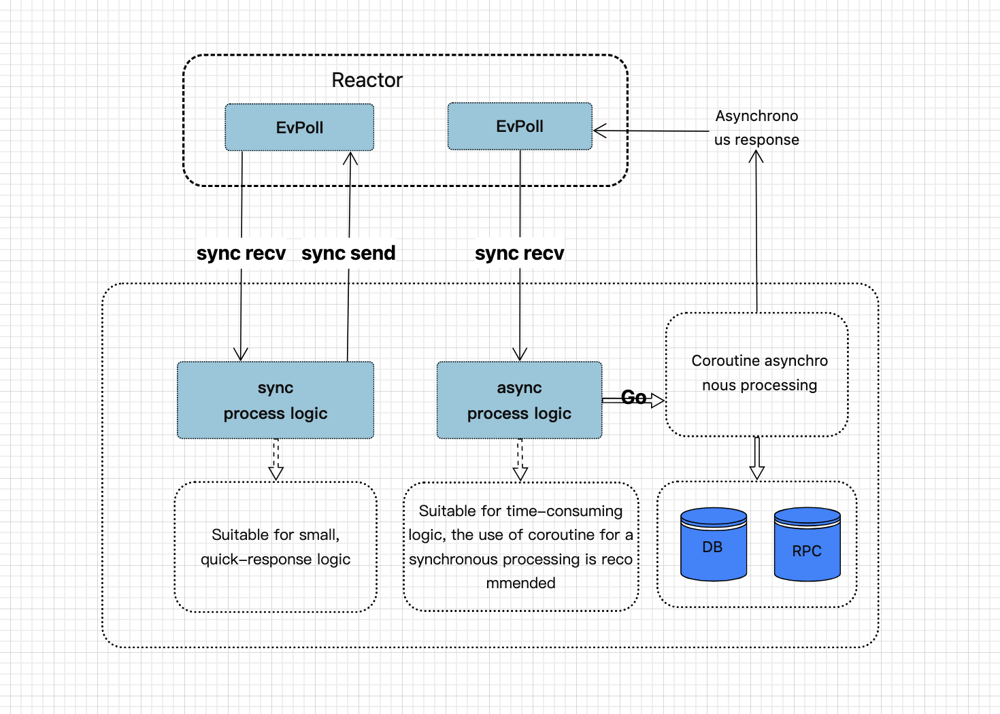
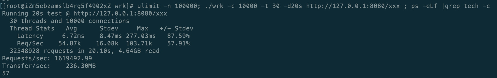

# Event-driven network framework in Go
[中文文档](https://zhuanlan.zhihu.com/p/648641683)

Goev provides a high-performance, lightweight, non-blocking, I/O event-driven networking framework for the Go language. It draws inspiration from the design patterns of [ACE](http://www.dre.vanderbilt.edu/~schmidt/ACE-overview.html) and provides an elegant and concise solution for TCP network programming projects. With goev, you can seamlessly integrate your projects without worrying about the coroutine pressure introduced by the standard library (go net).
Goev can achieve at least a 20% performance improvement in synchronous I/O compared to the go net library. Additionally, combined with lock-free processing within the framework, it provides better optimization opportunities, resulting in even higher overall performance gains.


## Features

* I/O event-driven architecture
* Lightweight and minimalist implementation of the Reactor pattern, allowing flexible combinations of multiple reactors
* Object-oriented implementation for easier encapsulation of business logic.
* Supporting asynchronous sending allows higher-level applications to perform synchronous I/O operations while asynchronously handling business processing
* Lock-free operations in a polling stack, enabling zero-copy data transfer for synchronous I/O.
* Perfect support for REUSEPORT multi-poller mode
* Built-in four-heap timer implementation, enabling lock-free/synchronous handling of I/O and timer events.
* Fully native implementation of acceptor/connector, providing maximum customizability.
* Controllable number of underlying threads. The per-connection per-goroutine approach usually leads to a surge in the number of threads, but using pollers helps maintain a consistent thread count, keeping it at the initial level
* Garbage collection (GC)-friendly, minimizing additional heap memory usage during runtime.
* Support interaction between the application layer and the poller, e.g. creating a cache within the poller coroutine, enabling lock-free usage. (like runtime.mcache)
* Few APIs and low learning costs

## Benchmarks

We're comparing gnet, which is ranked first on TechEmpower, using the test code from [gnet (GoLang) Benchmarking Test](https://github.com/TechEmpower/FrameworkBenchmarks/tree/master/frameworks/Go/gnet)

> Test environment GCP cloud VM, 2 cores, 4GB RAM

The bench results of gnet.
```text
wrk -c 2 -t 2 -d10s http://127.0.0.1:8080/xxx
Running 10s test @ http://127.0.0.1:8080/xxx
  2 threads and 2 connections
  Thread Stats   Avg      Stdev     Max   +/- Stdev
    Latency    47.79us  170.86us   8.95ms   99.59%
    Req/Sec    22.92k     1.00k   24.39k    78.11%
  458456 requests in 10.10s, 56.40MB read
Requests/sec:  45395.26
Transfer/sec:      5.58MB
```

The bench results of goev. [test code](https://github.com/shaovie/goev/blob/main/example/techempower.go)
```text
wrk -c 2 -t 2 -d10s http://127.0.0.1:8080/xxx
Running 10s test @ http://127.0.0.1:8080/xxx
  2 threads and 2 connections
  Thread Stats   Avg      Stdev     Max   +/- Stdev
    Latency    42.69us   92.32us   6.33ms   99.57%
    Req/Sec    23.49k     1.77k   26.37k    54.95%
  471993 requests in 10.10s, 68.87MB read
Requests/sec:  46733.75
Transfer/sec:      6.82MB
```
> Note: This is the most basic and simplest test, for reference only

> Test environment Aliyun ECS, 32 vcore, 64GB RAM  ./techempower -c 48 -p 64



## Installation

```bash
go get -u github.com/shaovie/goev
```

## Getting Started

See the [中文指南](DOCUMENT_CN.md) for the Chinese documentation.

### Simple Service Example

```go
package main

import (
    "github.com/shaovie/goev"
)

var connReactor *goev.Reactor

type Conn struct {
	goev.IOHandle
}

func (c *Conn) OnOpen() bool {
	if err := connReactor.AddEvHandler(c, c.Fd(), goev.EvIn); err != nil {
		return false
	}
	return true
}
func (c *Conn) OnRead() bool {
	buf, n, _ := c.Read()
	if n == 0 { // Abnormal connection
		return false
	}
    // parse msg
    return true
}
func (c *Conn) OnClose() {
    c.Destroc(h) // release resource
}

func main() {
	runtime.GOMAXPROCS(runtime.NumCPU()*2 - 1)
	listenReactor, err := goev.NewReactor(goev.EvPollNum(1))
	if err != nil {
		panic(err.Error())
	}
	connReactor, err := goev.NewReactor(goev.EvPollNum(runtime.NumCPU()*3/2))
	if err != nil {
		panic(err.Error())
	}
	_, err = goev.NewAcceptor(listenReactor, ":8080", func() goev.EvHandler { return new(Conn) })
	if err != nil {
		panic(err.Error())
	}

	go func() {
		if err = listenReactor.Run(); err != nil {
			panic(err.Error())
		}
	}()
    
	if err = connReactor.Run(); err != nil {
		panic(err.Error())
	}
}

```

### REUSEPORT Service Example

```go
package main

...

func main() {
	runtime.GOMAXPROCS(runtime.NumCPU()*2)
	evPollNum := runtime.NumCPU()*3/2
	connReactor, err := goev.NewReactor(goev.EvPollNum(evPollNum))
	if err != nil {
		panic(err.Error())
	}
    for i := 0; i < evPollNum; i++ {
        _, err = goev.NewAcceptor(connReactor, ":8080", func() goev.EvHandler { return new(Conn) },
            goev.ReusePort(true),
        )
        if err != nil {
            panic(err.Error())
        }
    }
	if err = connReactor.Run(); err != nil {
		panic(err.Error())
	}
}

```
> Note: The reactor will bind different acceptors (listener fd) to different epoll instances to achieve multithreaded concurrent listening on the same IP:PORT


## Development Roadmap

- [x] Async write (refer example/async_http.go)
- [x] Websocket example
- [x] Goev runtime GC zero pressure
- [x] Poller cache(like thread cache)
- [x] Poller sync. Allow the application layer to interact with the poller (limited to the operations supported by the framework) (refer example/download.go)
- [ ] Service oriented model
- [ ] Codec interface

## Contributing
Contributions are welcome! If you find any bugs or have suggestions for improvement, please open an issue or submit a pull request

## License
`goev` source code is available under the MIT License.
